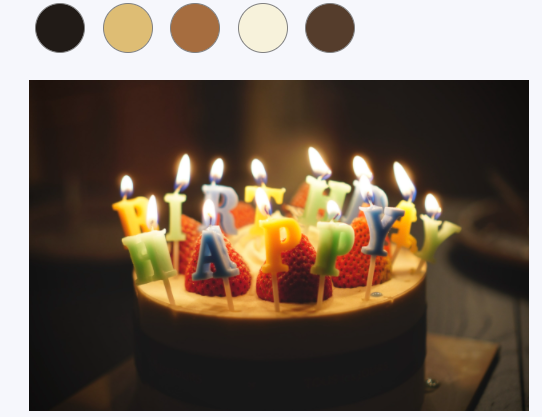

# Color Palette Creation
   

## Project Overview
* This project uses one of the many Clustering Algorithms - chosen by the user, to create clusters of colors present in an image and generates a Color Palette consisting of a user defined number of colors.
* A flask app deployed with heroku. Checkout the app here: https://color-clustering.herokuapp.com/

## Inspiration:
- This idea initially came to my mind when I saw a beautiful aurora scenery and wanted to paint it but only wanted to buy minimum colors for the purpose. I thought, what if Clustering could quickly tell me which colors most occur in the painting based on the number of colors I want to buy (the number of clusters that get created).

- Later that day, I noticed that while we create Instagram stories, it always picks colors itself for a background behind our video/image. Some of my own stories and their beautiful backgrounds selected by Instagram AI led me to think how this is being done!

- One way that this can be done is a quick clustering and sample a few top most colors from the palette thus created.
- For both the above use cases, I perform clustering for any given image url using Machine Learning clustering algorithms.

## Clustering Algorithms:
I used Heirarchical clustering, Kmeans, Kmeans++ and Birch algorithms and noticed they generate similar results. As such even a single algorithm does not produce similar clustering when run twice!

## Some Results:
This project when deployed to heroku usually times out as the clustering algorithms take very long to output the clusters! But the project runs smooth on local machine. Some of the interesting palettes the I created:

## Next steps:
This project when deployed to heroku usually times out as the clustering algorithms take very long to output the clusters! So now, I am trying to reduce this time taken. For now, using low resolution images helps to yield outputs fast on the deployed version!

_**----- Important Note -----**_ 
• If you encounter this webapp as shown in the picture given below, it is occuring just because **free dynos for this particular month provided by Heroku have been completely used.** _You can access the webpage on 1st of the next month._ 
• Sorry for the inconvenience.

