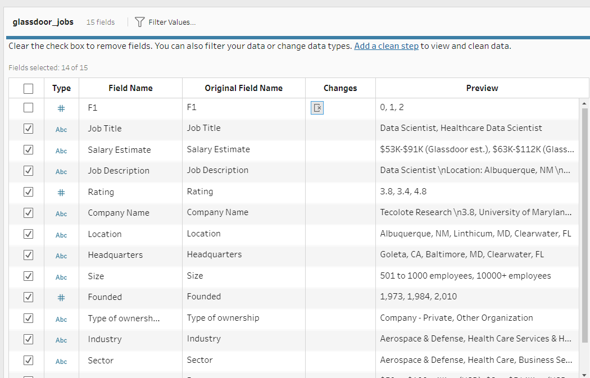
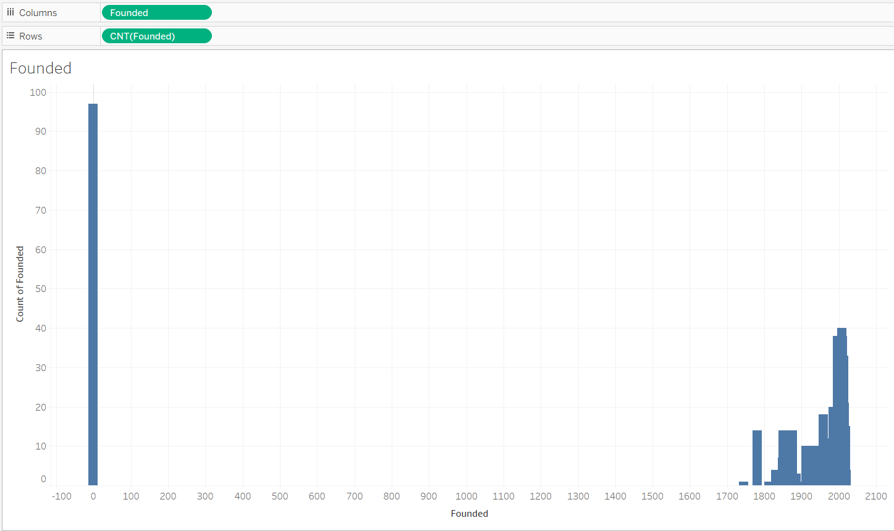
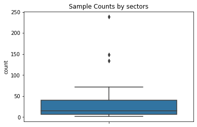
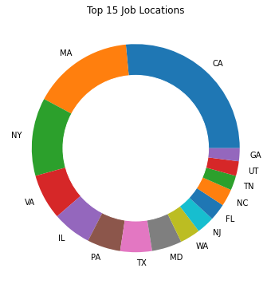
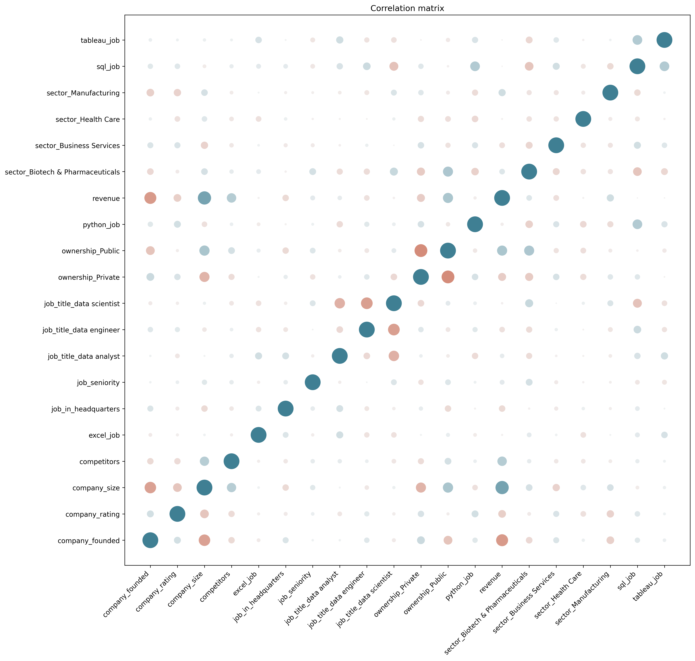
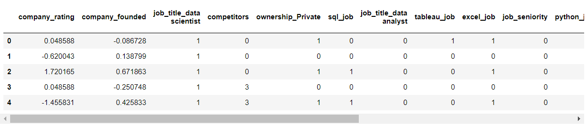
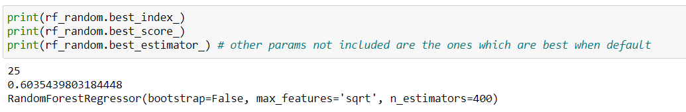

 

## Project Overview
• Created a machine learning model that **estimates salary of data scientist from features like revenue, job title, number of competitors, etc.** 

## How will this project help?
• This project can be **used by people in  data science and related fields to know their market rate and hence be prepared to negotiate their salary with their employers**

## Resources Used
• Packages: **pandas, numpy, sklearn, matplotlib, seaborn, pickle, Tableau, Tableau prep builder** 
• Dataset by **Ken Jee**: https://github.com/PlayingNumbers/ds_salary_proj
• Visualization Techniques by **Josh**: https://www.kaggle.com/joshuaswords/data-visualization-clustering-mall-data
• Graph ideas by **Python Graph Gallery**: https://www.python-graph-gallery.com/

## Exploratory Data Analysis (EDA) and Data Cleaning
• **Removed unwanted columns using Tableau prep builder**: 'Unnamed: 0' 

• **Plotted bargraphs and countplots** for gathering insight into features 
• **Removed unwanted alphabet/special characters from Salary feature** 
• **Numerical Features** (Rating, Founded): **Replaced NaN or -1 values with mean or meadian based on their distribution**<br/

• **Categorical Features: Replaced NaN or -1 values with 'Other'/'Unknown' category** 
• **Make the Salary column show one measure** i.e from (per hour, per annum, employer provided salary) to (per annum)

## Feature Engineering
• **Creating new features** from existing features e.g. **job_in_headquaters from (job_location, headquarters)**, etc. 
• Creating separate columns for different skills i.e. **Python, excel, sql, tableau** to depict job focus 
• **Reducing the number of categories** in columns like "job location", sector by **selecting top K categories, replacing rest by "others"** to reduce noise 
 
 
• Feature Selection using **information gain (mutual_info_regression) and correlation matrix** 
 
• Feature Scaling using **StandardScalar** such that final dataset is clean for evaluating on different models

## Model Building and Evaluation
Root Mean Squared Error (RMSE) is least for **Random Forest: ~17** out of the following tried algorithms (evaluated with cross validation on 10 folds) 

* Multiple Linear Regression: ~27 
* Lasso Regression: ~28 
* **Random Forest: ~17** 
* Gradient Boosting: ~24 
* Voting (Random Forest + Gradient Boosting): ~19 

## Model Hyper Parameter Tuning
Found best estimator from the following parameter grid (corresponding to the params in sklearn.ensemble.RandomForestRegressor):
* 'n_estimators': [200, 400, 600, 800, 1000, 1200, 1400, 1600, 1800, 2000]
* 'max_features': ['auto', 'sqrt']
* 'max_depth': [10, 20, 30, 40, 50, 60, 70, 80, 90, 100, 110, None]
* 'min_samples_split': [2, 5, 10]
* 'min_samples_leaf': [1, 2, 4]
* 'bootstrap': [True, False]

## Best Estimator:

## Saving the model
Used pickle to save the model for deployment to Heroku
